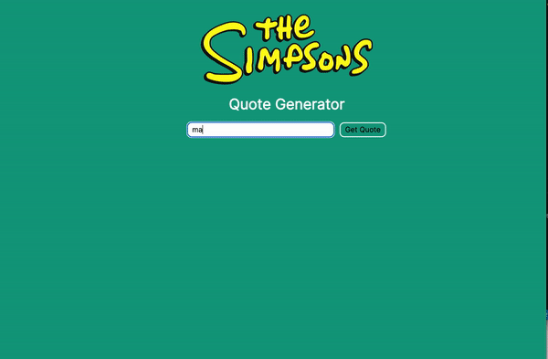

# Simpsons Quote Generator

This was a simple, fun project to practice with APIs. A character can be entered into the text box or it can be left blank. If a character is chosen, the API will return a photo of the character and a quote. If no input is given, a random character and quote will be returned.

## Built with
- HTML
- CSS
- JavaScript

## Lessons learned
I learned how to take an input and return multiple types of data back to the webpage. During this project I realized that a reset function is needed to clear the form after clicking "Get Quote" button. Otherwise the user would have to refresh the page to use the form again.

## Optimizations
Style was not a priority when building this project and more styling could be done to improve it visually.
